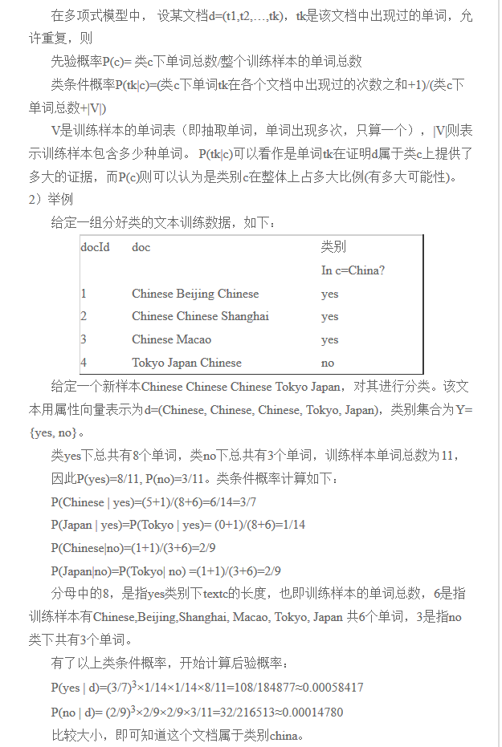
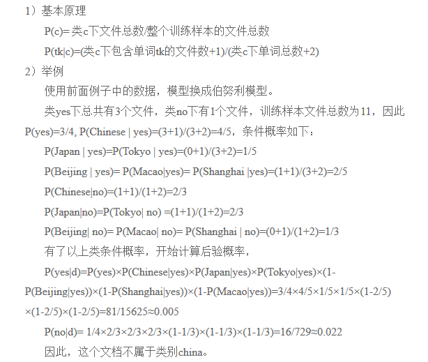

### apply函数

apply函数是pandas里面所有函数中自由度最高的函数。该函数如下：

DataFrame.apply(func, axis=0, broadcast=False, raw=False, reduce=None, args=(), **kwds)

该函数最有用的是第一个参数，这个参数是函数，相当于C/C++的函数指针。

这个函数需要自己实现，函数的传入参数根据axis来定，比如axis = 1，就会把一行数据作为Series的数据
结构传入给自己实现的函数中，我们在函数中实现对Series不同属性之间的计算，返回一个结果，则apply函数
会自动遍历每一行DataFrame的数据，最后将所有结果组合成一个Series数据结构并返回。

比如以下使用方式：
```
df['num_punctuations'] = df['text'].apply(lambda x: len([word for word in str(x) if word in string.punctuation]))
```
以上的使用方式是对DataFrame的数据格式中的一列做操作，在第一个参数中传入lamda函数作为参数。

### K折交叉验证

```
sklearn.model_selection.KFold(n_splits=3, shuffle=False, random_state=None)
```
思路：将训练/测试数据集划分n_splits个互斥子集，每次用其中一个子集当作验证集，剩下的n_splits-1个作为训练集，进行n_splits次训练和测试，得到n_splits个结果

注意点：对于不能均等份的数据集，其前n_samples % n_splits子集拥有n_samples // n_splits + 1个样本，其余子集都只有n_samples // n_splits样本

参数说明：
n_splits：表示划分几等份
shuffle：在每次划分时，是否进行洗牌

①若为Falses时，其效果等同于random_state等于整数，每次划分的结果相同

②若为True时，每次划分的结果都不一样，表示经过洗牌，随机取样的

random_state：随机种子数

属性：
```
①get_n_splits(X=None, y=None, groups=None)：获取参数n_splits的值
```
```
②split(X, y=None, groups=None)：将数据集划分成训练集和测试集，返回索引生成器
```
### MultinomialNB(多项式模型)



### 伯努利模型
基于上述例子：



### TF-IDF

>tf-idf（英语：term frequency–inverse document frequency）是一种用于信息检索与文本挖掘的常用加权技术。tf-idf是一种统计方法，用以评估一字词对于一个文件集或一个语料库中的其中一份文件的重要程度。字词的重要性随着它在文件中出现的次数成正比增加，但同时会随着它在语料库中出现的频率成反比下降。tf-idf加权的各种形式常被搜索引擎应用，作为文件与用户查询之间相关程度的度量或评级。

原理
>在一份给定的文件里，词频（term frequency，tf）指的是某一个给定的词语在该文件中出现的频率。这个数字是对词数（term count）的归一化，以防止它偏向长的文件。（同一个词语在长文件里可能会比短文件有更高的词数，而不管该词语重要与否。）对于在某一特定文件里的词语ti来说，它的重要性可表示为：
```math
{\mathrm  {tf_{{i,j}}}}={\frac  {n_{{i,j}}}{\sum _{k}n_{{k,j}}}}

```
>以上式子中分子是该词在文件dj中的出现次数，而分母则是在文件dj中所有字词的出现次数之和。

>逆向文件频率（inverse document frequency，idf）是一个词语普遍重要性的度量。某一特定词语的idf，可以由总文件数目除以包含该词语之文件的数目，再将得到的商取以10为底的对数得到：

```math
{\displaystyle \mathrm {idf_{i}} =\lg {\frac {|D|}{|\{j:t_{i}\in d_{j}\}|}}}
```
其中

* |D|：语料库中的文件总数
* 分母为包含词语ti的文件数目（即ni,j!=0的数目），如果词语不在数据中，就导致分母为零，因此一般情况下使用
```math
1+|\{j:t_{{i}}\in d_{{j}}\}|
```
然后
```math
{\mathrm  {tf{}idf_{{i,j}}}}={\mathrm  {tf_{{i,j}}}}\times {\mathrm  {idf_{{i}}}}
```
（即为ti词的tf-idf分数）某一特定文件内的高词语频率，以及该词语在整个文件集合中的低文件频率，可以产生出高权重的tf-idf。因此，tf-idf倾向于过滤掉常见的词语，保留重要的词语。

举例：
>假如一篇文件的总词语数是100个，而词语“母牛”出现了3次，那么“母牛”一词在该文件中的词频就是3/100=0.03。而计算文件频率（IDF）的方法是以文件集的文件总数，除以出现“母牛”一词的文件数。所以，如果“母牛”一词在1,000份文件出现过，而文件总数是10,000,000份的话，其逆向文件频率就是lg（10,000,000 / 1,000）=4。最后的tf-idf的分数为0.03 * 4=0.12。
